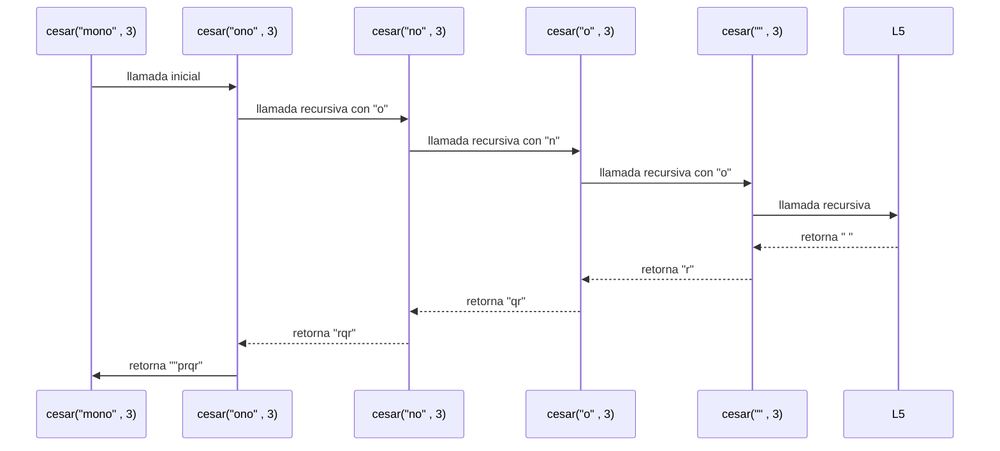
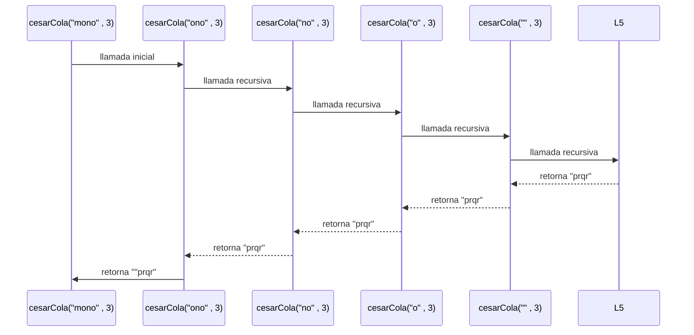
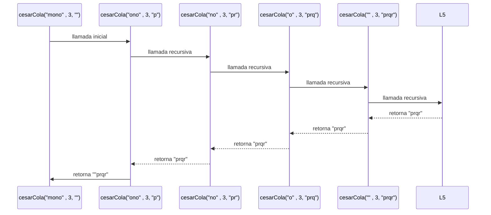

# Taller 1. Cifrados Clásicos de Recursión Lineal

##  1. Cesar con recursión lineal
## Definición del Algoritmo

```Scala
def cesar(m: Mensaje, k: Int): Mensaje = {
    if (m.isEmpty){ 
      "" 
    }else{
      val c = m.head 
      if (esMinuscula(c)){ 
        val ubicacionInicial = c.toInt - primera 
        val ubicacionNueva = ((ubicacionInicial + k ) % letras + letras)% letras 
        val letraNueva = (ubicacionNueva + primera).toChar

        letraNueva + cesar(m.tail, k) 

      }else {
        c + cesar(m.tail, k) 

      }

    }
  }
```

* La función `cesar` cifra un mensaje `m`  aplicando un desplazamiento `k`  a cada letra minúscula del alfabeto.


* La función recibe dos parámetros:

    * `m`: Contiene el mensaje que se quiere cifrar.
    * `k`: Indíca cuantas posiciones se debe mover cada letra en el alfabeto.
* La función toma una letra, la procesa y luego vuelve a llamarse con el resto del mensaje. por este mótivo se utilizò recursión lineal.
## Explicación paso a paso

### Caso base

```Scala
if (m.isEmpty){ 
   "" 
    }
```

Cuando el mensaje `m` este vacío, la función devuelve una cadena vacía` "" ` y no devuelven más llamados.

### Caso recursivo

```Scala
 letraNueva + cesar(m.tail, k)
```

En cada llamada:

* Se obtiene la primera letra del mensaje mediante `m.head`.
* Luego mediante  `m.tail` se obtiene el resto del mensaje.
* Si la letra es minúscula, se calcula el nuevo posicionamiento aplicando el desplazamiento `k`
* Luego se realiza una nueva llamada con el resto del mensaje.
* Como la llamada es recursiva todavía debe combinarse con letraNueva, esta función deja una operación pendiente en cada llamado.

---

## Llamados de pila en recursión Lineal

Ejemplo:

```Scala
cesar("mono",3) 
```

### Paso 1: Llamada inicial

```Scala
cesar("mono", 3) // ->"p" + cesar("ono",3)

```

### Paso 2: Primera iteración

```Scala
cesar("ono", 3)  // ->"r" + cesar("no",3)
```

### Paso 3: Segunda iteración

```Scala
cesar("no", 3) //->"q" + cesar("o",3)
```

### Paso 4: Tercera iteración

```Scala
cesar("o", 3) // -> "r" + cesar("",3)
```

### Paso 6: Caso base

```Scala
cesar ("", 3) // -> ""
```
* Despuès del caso base, las llamadas pendientes comienzan a resolverse hasta tener:
```Scala
cesar("mono") -> "prqr" 
cesar(",3)-> " "
cesar("o",3)--> "r" + "" -> "r"
cesar("no",3)--> "q" + "r" -> "qr"
cesar("ono",3)--> "r" + "qr" -> "rqr"
cesar("mono",3) --> "p" + "rqr" -> "prqr"
```
---
## Diferencia con recursión de Cola

* En **cesar** cada llamada debe esperar el resultado de la siguiente llamada para poder combinarlo con la letra actual.  
* por este motivo las llamadas permanecen en espera en la pila mientras se procesa el resto del mensaje.

## Ejemplo de uso

```Scala
val resultado = cesar("mono", 3)
println(resultado)  // "prqr"
```

El resultado de `cesar("mono",3)` es `prqr`.


## Diagrama de llamados de pila con recursión Lineal




##  2. Cesar con recursión de Cola
## Definición del Algoritmo

```Scala
  @tailrec
  final def cesarCola(m: Mensaje, k: Int, acc: Mensaje = ""): Mensaje = {

      if (m.isEmpty){
        acc
      }else {
        val c = m.head

        if (esMinuscula(c)){
          val ubicacionInicial = c.toInt - primera
          val ubicacionNueva = ((ubicacionInicial + k ) % letras + letras) % letras
          val letraNueva = (ubicacionNueva + primera).toChar
          
          cesarCola(m.tail, k, acc + letraNueva)
        }else {
          cesarCola(m.tail, k , acc + c)
        }
      }
  }

```

* La función `cesarCola` realiza el mismo cifrado que cesar pero utilizando recursiòn de cola.


* La función `cesarCola`  recibe dos parámetros:

   * `m`: Contiene el mensaje que se quiere cifrar.
   * `k`: Indíca cuantas posiciones se debe mover cada letra en el alfabeto.
   * `acc`: acumulador que guarda parcialmente el resultado del mensaje parcialmente.
   * El decorador @tailrec permite comprobar que la llamada recursiva se encuentre en posición de cola.

## Explicación paso a paso

### Caso base

```Scala
if (m.isEmpty){ 
   "" 
    }
```

Cuando el mensaje `m` este vacío, la función devuelve el contenido acumulado `acc`.

### Caso recursivo

```Scala
  cesarCola(m.tail, k, acc + letraNueva)
```

En cada llamada:

* Se obtiene la primera letra del mensaje mediante `m.head`.
* Se calcula la nueva letra.
* La nueva letra se agrega al acumulador.
* Se realiza la siguiente llamada utilizando el resto del mensaje.
* La llamada recursiva es la ultima operación de la función por eso es una recursión de cola.

---

## Llamados de pila en recursión Lineal

Ejemplo:

```Scala
cesarCola("mono",3)
```

### Paso 1: Llamada inicial

```Scala
cesarCola("mono", 3, "") //cesarCola("ono",3, "p")

```

### Paso 2: Primera iteración

```Scala
cesarCola("ono", 3, "o") // cesarCola("no",3,"pr")
```

### Paso 3: Segunda iteración

```Scala
cesarCola("no", 3, "or") // cesarCola("o",3,"prq")
```

### Paso 4: Tercera iteración

```Scala
cesarCola("o", 3, "orp") // cesarCola("",3,"prqr")
```

### Paso 6: Caso base

```Scala
cesarCola("", 3, "orpr")  //-> "prqr"
```
## Ejemplo del acumulador acc

```Scala
cesarCola("mono",3,"") -->> acumulador(acc) = ""
cesarCola("ono",3, "p") -->> acumulador(acc) = "p"
cesarCola("no",3, "pr")-->> acumulador(acc) = "pr"
cesarCola("o",3, "prq") -->> acumulador(acc) = "prq"
cesarCola("",3, "prqr") -->> acumulador(acc) = "prqr"
```

---
## Diferencia con recursión normal

La diferencia está en la forma en que se utilizan las llamadas y la pila.
* En **cesar** cada llamada debe esperar el resultado de la siguiente llamada para poder combinarlo con la letra actual.  por eso las llamadas recursivas se acumulan en la pila, asi el uso de la pila aumenta a medida que aumenta el tamaño del mensaje.
* En **recursión de cola**, el resultado parcial se guarda en el acumulador  y la llamada recursiva es la última operación, por eso, no se acumulan en la pila llamadas pendientes y el uso de memoria de pila se mantiene constante.
---

## Ejemplo de uso

```Scala
val resultado = cesarCola("mono", 3,)
println(resultado)  // "prqr"
```

## Diagrama de llamados de pila con recursión de cola


## Diagrama de llamados de pila con recursión de cola con acumulador 




