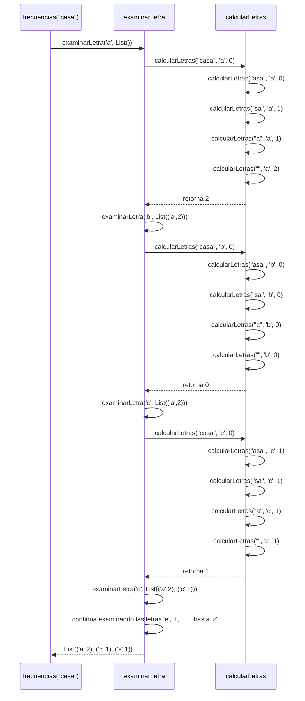

## Punto 3 - Informe de proceso 

### Definición del algoritmo

### Código a analizar

```scala
def frecuencias(m: Mensaje): Frecuencias = {
  @tailrec
  def calcularLetras(
      mensajeSobra: Mensaje,
      letra: Char,
      totalLetra: Int
  ): Int = {
    if (mensajeSobra.isEmpty) {
      totalLetra
    }
    else if (mensajeSobra.head == letra) {
      calcularLetras(mensajeSobra.tail, letra, totalLetra + 1)
    }
    else {
      calcularLetras(mensajeSobra.tail, letra, totalLetra)
    }
  }

  @tailrec
  def examinarLetra(
      letra: Char,
      guardar: Frecuencias
  ): Frecuencias = {
    if (letra > 'z') {
      guardar.sortWith((a, b) =>
        if (a._2 == b._2) {
          a._1 < b._1
        }
        else {
          a._2 > b._2
        }
      )
    }
    else {
      val totalLetra: Int = calcularLetras(m, letra, 0)

      if (totalLetra > 0) {
        val listaNueva: Frecuencias =
          guardar :+ (letra, totalLetra)

        examinarLetra(
          (letra.toInt + 1).toChar,
          listaNueva
        )
      }
      else {
        examinarLetra(
          (letra.toInt + 1).toChar,
          guardar
        )
      }
    }
  }

  examinarLetra('a', List())
}

```

### Descripción corta de las funciones usadas

La función 'frecuencias' cuenta cuántas veces aparece cada letra minúscula en un mensaje
Para realizar el proceso se utilizan 2 funciones auxiliares:

- mensajeSobra: Contiene la parte del mensaje que aún no se ha recorrido.
  En cada llamada recursiva se elimina el primer carácter hasta que no quede nada 
  que revisar

- letra: Indica que letra se está contando en ese momento dentro del mensaje

### Funciones Auxiliares:

- 'calcularLetras': Recorre todo el mensaje carácter por carácter para contar cuántas veces
  aparece una letra específica. Como tal en cada llamada revisa el primer carácter de ´mensajeSobra´
  Si el carácter recorrido es igual a la letra buscada, aumenta ´totalLetra´, si no coincide, conserva su valor;
  este proceso continúa hasta que ya no queden caracteres por revisar

- 'totalLetra': Es el acumulador que guarda cuántas veces ha encontrado la ´letra´ buscada hasta el momento durante el recorrido del mensaje
  si la letra no coincide entonces conserva el mismo valor. Al final del recorrido solo contiene la cantidad de apariciones de esa letra en el mensaje

- 'examinarLetra:' Revisa todas las letras desde la 'a' hasta la 'z' y agrega a la lista únicamente las letras que 
  aparecen al menos 1 vez en el mensaje, junto con su frecuencia

- 'guardar': Lista donde se almacenan las frecuencias encontradas

- '@tailrec': Es una anotación que verifica que la función esté escrita con recursión de cola, como tal hace que la llamada recursiva sea la última operación realizada
  permitiendo que en Scala se optimice la ejecución y se reutilice el espacio de la pila

  
Ambas funciones ´calcularLetras´ y ´examinarLetra´ utilizan la anotación ´@tailrec´, por lo que trabajan con recursión de cola.
Al finalizar el recorrido, sortWith organiza la lista ordenando de mayor a menor frecuencia y si las 2 letras tienen la misma frecuencia 
las ordena alfabéticamente

### Llamado de pila de ´calcularLetras´

Ejemplo:
```scala
calcularLetras("casa", 'a', 0)
```

#### Paso 1: Llamada inicial - Punto donde inicia el conteo
El primer carácter es 'c'
```scala
calcularLetras("casa", 'a', 0)
```
Y como 'c' no es igual a ´a´, el acumulado sigue siendo 0
```scala
totalLetra = 0
```

#### Paso 2: Segunda llamada - Encuentro de la primera 'a' y aumento del contador

```scala
calcularLetras("asa", 'a', 0)
```
Ahora el primer carácter es: 'a'
Como coincide con la letra que se buscaba entonces se actualiza:
```scala
totalLetra = 0 + 1
```
La siguiente llamada es:
```scala
calcularLetras("sa", 'a', 1)
```

#### Paso 3: Tercera llamada - Revisión de la letra 's'

```scala
calcularLetras("sa", 'a', 1)
```
El carácter 's' no coincide con 'a'. Entonces el acumulador conserva su valor:
```scala
totalLetra = 1
```
Y se continúa con
```scala
calcularLetras("a", 'a', 1)
```

#### Paso 4: Cuarta llamada - Encuentro de la segunda 'a'
```scala
calcularLetras("a", 'a', 1)
```
Como la letra coincide entonces
```scala
totalLetra = 1 + 1
```
Y se llama:
```scala
calcularLetras("", 'a', 2)
```

#### Paso 5: Caso base - Finalización del recorrido del mensaje
```scala
calcularLetras("", 'a', 2)
```

Como el mensaje está vacío entonces se devuelve que quedo almacenado de 'totalLetra'
```scala
totalLetra = 2
```
Que en este caso sería 2
```scala
2
```

### Función examinarLetra

La función a analizar será en este caso
```scala
examinarLetra(letra, guardar)
```
Como tal esta función recibe 'letra' y 'guardar', y su llamado inicial es:

```scala
examinarLetra('a', List())
```

#### Caso base - Fin del recorrido del alfabeto
```scala
if (letra > 'z')
```
Cuando la letra supere a 'z', significa que ya se revisaron todas las letras minúsculas
utilizándose guardar para ordenar la lista

#### Caso recursivo

Para cada letra se ejecuta
```scala
val totalLetra: Int = calcularLetras(m, letra, 0)
```

Sí la parte de 
```scala
totalLetra > 0
```

Se agrega la letra y su frecuencia
```scala
guardar :+ (letra, totalLetra)
```

Si la frecuencia es 0 no se agrega y luego se avanza a la siguiente letra mediante
```scala
(letra.toInt + 1).toChar
```

#### Llamado de 'examinarLetra'

Ejemplo:
```scala
frecuencias("casa")
```
#### Paso 1 - Primera llamada de la función
```scala
examinarLetra('a', List())
```
Se calcula:
```scala
calcularLetras("casa", 'a', 0)
```
Teniendo como resultado
```scala
2
```
Como la frecuencia es > 0 se guarda
```scala
List(('a', 2))
```
Se continua con 
```scala
examinarLetra('b', List(('a', 2)))
```

#### Paso 2: Segundo llamado - Frecuencia 'a' guardada y se continúa con la 'b'
```scala
examinarLetra('b', List(('a', 2)))
```
Se calcula
```scala
calcularLetras("casa", 'b', 0)
```
Obteniendo como resultado: 0
Como 'b' no aparece la lista no cambia y se continúa con:
```scala
examinarLetra('c', List(('a', 2)))
```

#### Paso 3: Tercer llamado - Revisión de la letra 'c'
```scala
examinarLetra('c', List(('a', 2)))
```
Se calcula
```scala
calcularLetras("casa", 'c', 0)
```
Y su resultado es: 1
Entonces se agrega a la lista
```scala
List(('a',2), ('c',1))
```
### Continuidad del proceso: Avances a las siguientes letras
Como tal el proceso continúa de la misma manera con todas las letras

$d -> e -> f -> g -> ... -> z$
Hasta que llegue a la letra 's' en donde se obtiene una frecuencia de 1 
Al finalizar el recorrido se tiene que:

```scala
List(('a',2), ('c',1), ('s',1))
```

### Ordenamiento final

Cuando ya se revisaron todas las letras entonces se ejecuta
```scala
guardar.sortWith(....)
```
Si las frecuencias son distintas $ a._2 > b._2 $

Se coloca de primero la letra que más apariciones

Si se da el caso que las frecuencias son iguales
entonces se organiza de forma alfabética
```scala
a._1 < b._1
```
por ejemplo:
a -> 2
c -> 1
s -> 1

Queda
```scala
List(('a',2), ('c',1), ('s',1))
```

Ejemplo de uso
```scala
val resultado = frecuencias("casa")
println(resultado)
```
Devolviendo como respuesta
```scala
List(('a',2), ('c',1), ('s',1))
```

### Diagrama de llamados de pila con recursión de cola
El siguiente diagrama muestra como se relacionan las funciones 'frecuencias, examinarLetra' y 'calcularLetras' durante su ejecución.
La ejecución comienza cuando 'frecuencias("casa")' llama a:


### Comportamiento de la pila

En 'calcularLetras' y 'examinarLetra', la llamada recursiva es la última operación que se realiza.

Teniendo esto en cuenta, en Scala puede optimizar la recursión 
de cola además de reutilizar el mismo espacio de ejecución.

En 'calcularLetras' los datos necesarios para continuar se mantienen en 'mensajeSobra', 'letra' y 'totalLetra'.

En 'examinarLetra', el estado se mantienen en 'letra' y 'guardar', evitando de que queden operaciones pendientes 
después de las llamadas recursivas

