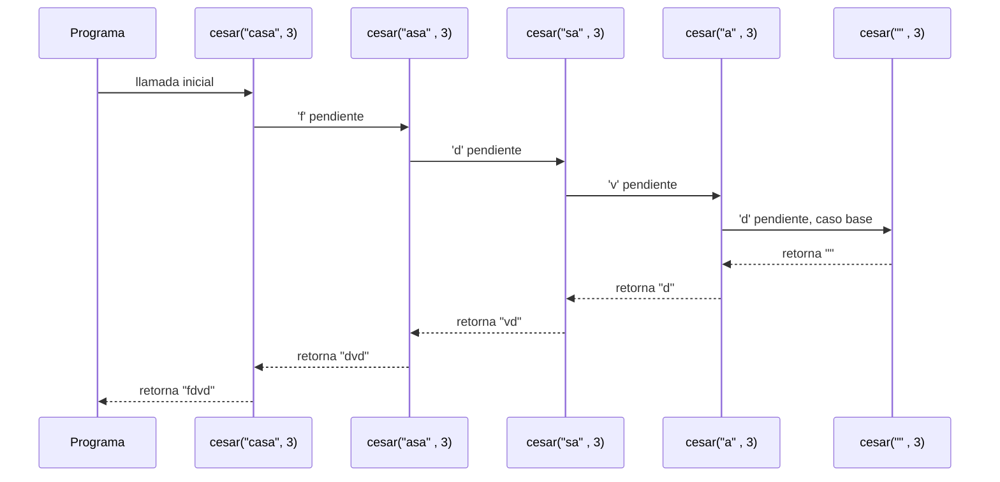
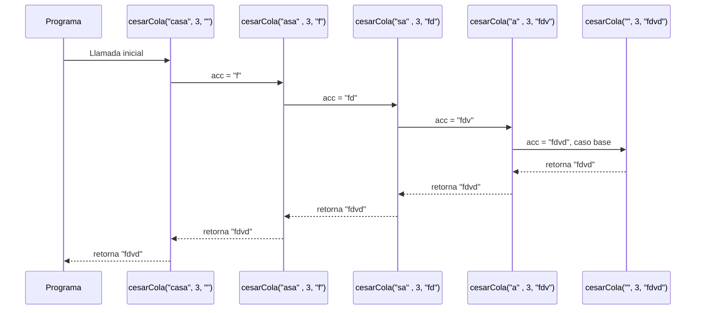
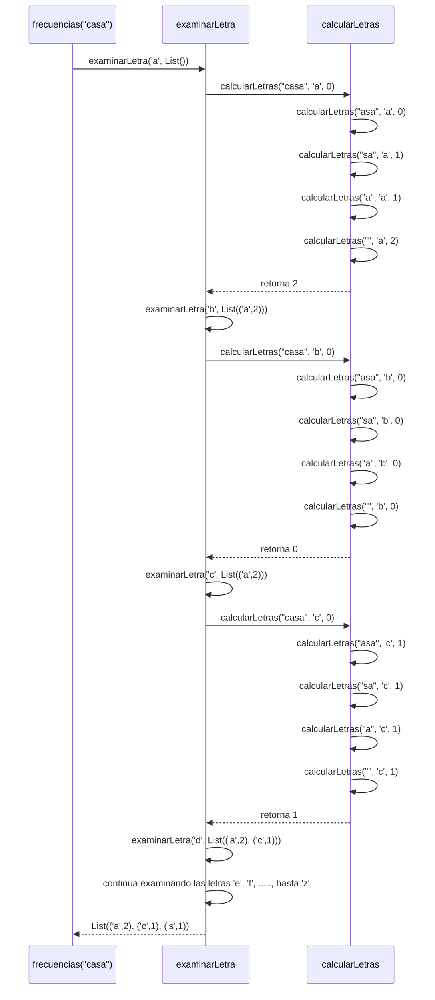
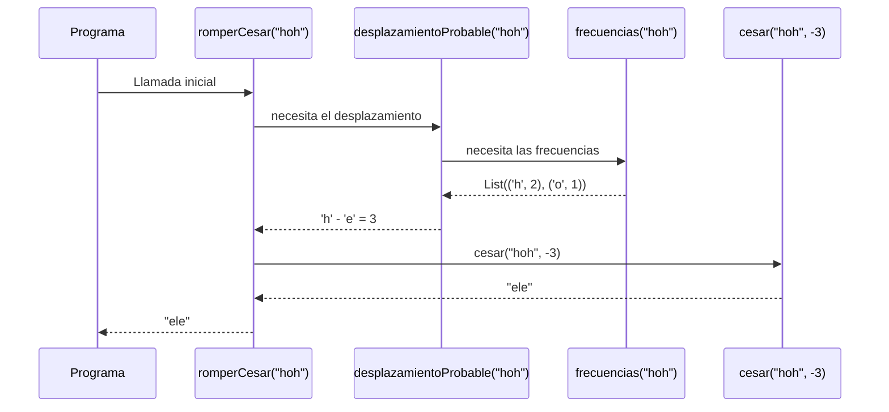
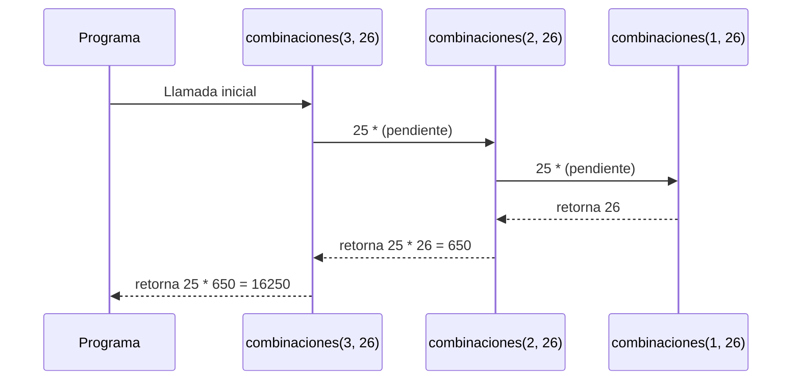
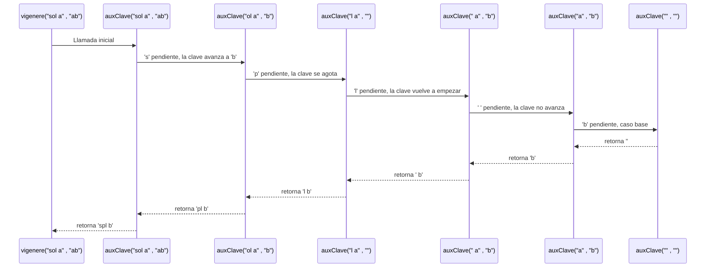

# Taller 1. Cifrados Clásicos de Recursión Lineal

##  1. Cesar con recursión lineal
## Definición del Algoritmo

```Scala
 
def cesar(m: Mensaje, k: Int): Mensaje = {
    if (m.isEmpty){ 
      "" 
    }else{
      val c = m.head 
      if (esMinuscula(c)){ 
        val ubicacionInicial = c.toInt - primera 
        val ubicacionNueva = ((ubicacionInicial + k ) % letras + letras)% letras 
        val letraNueva = (ubicacionNueva + primera).toChar

        letraNueva + cesar(m.tail, k) 

      }else {
        c + cesar(m.tail, k) 

      }

    }
  }
```

* La función `cesar` cifra un mensaje `m`  aplicando un desplazamiento `k`  a cada letra minúscula del alfabeto.


* La función recibe dos parámetros:

    * `m`: Contiene el mensaje que se quiere cifrar.
    * `k`: Indíca cuantas posiciones se debe mover cada letra en el alfabeto.
  
* La función toma una letra, la procesa y luego vuelve a llamarse con el resto del mensaje. por este mótivo se utilizò recursión lineal.
## Explicación paso a paso

### Caso base

```Scala
if (m.isEmpty) ""
```

Cuando el mensaje `m` esté vacío, la función devuelve una cadena  `vacía ""` y no hace más llamados.

### Caso recursivo

```Scala
 letraNueva + cesar(m.tail, k)
```

En cada llamada:

* Se obtiene la primera letra del mensaje mediante `m.head`.
* Luego mediante  `m.tail` se obtiene el resto del mensaje.
* Si la letra es minúscula, se calcula el nuevo posicionamiento aplicando el desplazamiento `k`
* Luego se realiza una nueva llamada con el resto del mensaje.
* Como la llamada es recursiva todavía debe combinarse con `letraNueva`, esta función deja una operación pendiente en cada llamado.

---

## Llamados de pila en recursión Lineal

Ejemplo:

```Scala
cesar("casa",3) 
```

### Paso 1: Llamada inicial

```Scala
cesar("casa", 3) // -> "f" + cesar("asa",3)

```

### Paso 2: Primera iteración

```Scala
cesar("asa", 3)  // -> "d" + cesar("sa",3)
```

### Paso 3: Segunda iteración

```Scala
cesar("sa", 3) //-> "v" + cesar("a",3)
```

### Paso 4: Tercera iteración

```Scala
cesar("a", 3) // -> "d" + cesar("",3)
```

### Paso 5: Caso base

```Scala
cesar ("", 3) // -> ""
```
* Después del caso base, las llamadas pendientes comienzan a resolverse hasta tener:
```Scala
cesar("",3) -> ""
cesar("a",3)--> "d" + "" -> "d"
cesar("sa",3)--> "v" + "d" -> "vd"
cesar("asa",3)--> "d" + "vd" -> "dvd"
cesar("casa",3) --> "f" + "dvd" -> "fdvd"
```
---
## Diferencia con recursión de Cola

* En **cesar** cada llamada debe esperar el resultado de la siguiente llamada para poder combinarlo con la letra actual.  
* por este mótivo las llamadas permanecen en espera en la pila mientras se procesa el resto del mensaje.
* La comparación paso a paso con `cesarCola("casa", 3)` está en el punto 2.

## Ejemplo de uso

```Scala
val resultado = cesar("casa", 3)
println(resultado)  // "fdvd"
```

El resultado de `cesar("casa",3)` es `fdvd`.


## Diagrama de llamados de pila con recursión Lineal




##  2. Cesar con recursión de Cola
## Definición del Algoritmo

```Scala
  @tailrec
  final def cesarCola(m: Mensaje, k: Int, acc: Mensaje = ""): Mensaje = {

      if (m.isEmpty){
        acc
      }else {
        val c = m.head

        if (esMinuscula(c)){
          val ubicacionInicial = c.toInt - primera
          val ubicacionNueva = ((ubicacionInicial + k ) % letras + letras) % letras
          val letraNueva = (ubicacionNueva + primera).toChar
          
          cesarCola(m.tail, k, acc + letraNueva)
        }else {
          cesarCola(m.tail, k , acc + c)
        }
      }
  }

```

* La función `cesarCola` realiza el mismo cifrado que cesar pero utilizando recursiòn de cola.


* La función `cesarCola`  recibe tres parámetros:

   * `m`: Contiene el mensaje que se quiere cifrar.
   * `k`: Indíca cuantas posiciones se debe mover cada letra en el alfabeto.
   * `acc`: acumulador que guarda parcialmente el resultado del mensaje.
* El decorador `@tailrec` permite comprobar que la llamada recursiva sea recursión de cola.

## Explicación paso a paso

### Caso base

```Scala
if (m.isEmpty) acc
```

Cuando el mensaje `m` esté vacío, la función devuelve el contenido acumulado `acc`.

### Caso recursivo

```Scala
  cesarCola(m.tail, k, acc + letraNueva)
```

En cada llamada:

* Se obtiene la primera letra del mensaje mediante `m.head`.
* Se calcula la nueva letra.
* La nueva letra se agrega al acumulador.
* Se realiza la siguiente llamada utilizando el resto del mensaje.
* La llamada recursiva es la última operación de la función por eso es una recursión de cola.

---

## Llamados de pila en recursión de cola

Ejemplo:

```Scala
cesarCola("casa",3)
```

### Paso 1: Llamada inicial

```Scala
cesarCola("casa", 3, "") //cesarCola("asa", 3, "f")
```

### Paso 2: Primera iteración

```Scala
cesarCola("asa", 3, "f") // cesarCola("sa", 3,"fd")
```

### Paso 3: Segunda iteración

```Scala
cesarCola("sa", 3, "fd") // cesarCola("a", 3,"fdv")
```

### Paso 4: Tercera iteración

```Scala
cesarCola("a", 3, "fdv") // cesarCola("", 3,"fdvd")
```

### Paso 5: Caso base

```Scala
cesarCola("", 3, "fdvd")  // -> "fdvd"
```
## Ejemplo del acumulador acc

```Scala
cesarCola("casa",3,"") -->> acumulador(acc) = ""
cesarCola("asa",3, "f") -->> acumulador(acc) = "f"
cesarCola("sa",3, "fd")-->> acumulador(acc) = "fd"
cesarCola("a",3, "fdv") -->> acumulador(acc) = "fdv"
cesarCola("",3, "fdvd") -->> acumulador(acc) = "fdvd"
```

---
## Diferencia con recursión lineal

La diferencia está en la forma en que se utilizan las llamadas y la pila.
* En **cesar** cada llamada debe esperar el resultado de la siguiente para poder combinarlo con la letra actual.  Por eso las llamadas recursivas se acumulan en la pila, así el uso de la pila aumenta a medida que aumenta el tamaño del mensaje.
* En **recursión de cola**, el resultado parcial se guarda en el acumulador  y la llamada recursiva es la última operación, por eso, no se acumulan en la pila llamadas pendientes y el uso de memoria de pila se mantiene constante.

### Comparación concreta: `cesar("casa", 3)` vs `cesarCola("casa", 3)`

Ambas devuelven `"fdvd"`, pero la pila se comporta distinto:

| Paso | `cesar` (lineal)                                                            | `cesarCola` (cola)                                     |
|------|-----------------------------------------------------------------------------|--------------------------------------------------------|
| 1    | `'f' + cesar("asa", 3)`                                                     | `cesarCola("asa", 3, "f")`                             |
| 2    | `'d' + cesar("sa", 3)`                                                      | `cesarCola("sa", 3, "fd")`                             |
| 3    | `'v' + cesar("a", 3)`                                                       | `cesarCola("a", 3, "fdv")`                             |
| 4    | `'d' + cesar("", 3)`                                                        | `cesarCola("", 3, "fdvd")`                             |
| 5    | caso base: `""`                                                             | caso base: `"fdvd"`                                    |
| Retorno | se resuelve de atrás hacia adelante: `""`, `"d"`, `"vd"`, `"dvd"`, `"fdvd"` | el resultado ya está armado en `acc`, solo se devuelve |

**Conclusión**
* En `cesar`, cada llamada deja una letra pendiente (`'f'`, `'d'`, `'v'`, `'d'`) y no puede terminar hasta que la siguiente devuelva su resultado. Hay 5 llamadas
esperando a la vez, y la pila crece con el tamaño del mensaje.
* En `cesarCola`, la letra ya quedó guardada en `acc` antes de llamar a la siguiente. La llamada recursiva es lo último que hace la función y no queda nada pendiente, por lo que la pila no crece.
---

## Ejemplo de uso

```Scala
val resultado = cesarCola("casa", 3)
println(resultado)  // "fdvd"
```

## Diagrama de llamados de pila con recursión de cola con acumulador


## Punto 3 - Informe de proceso

### Definición del algoritmo

### Código a analizar

```scala
def frecuencias(m: Mensaje): Frecuencias = {
  @tailrec
  def calcularLetras(
      mensajeSobra: Mensaje,
      letra: Char,
      totalLetra: Int
  ): Int = {
    if (mensajeSobra.isEmpty) {
      totalLetra
    }
    else if (mensajeSobra.head == letra) {
      calcularLetras(mensajeSobra.tail, letra, totalLetra + 1)
    }
    else {
      calcularLetras(mensajeSobra.tail, letra, totalLetra)
    }
  }

  @tailrec
  def examinarLetra(
      letra: Char,
      guardar: Frecuencias
  ): Frecuencias = {
    if (letra > 'z') {
      guardar.sortWith((a, b) =>
        if (a._2 == b._2) {
          a._1 < b._1
        }
        else {
          a._2 > b._2
        }
      )
    }
    else {
      val totalLetra: Int = calcularLetras(m, letra, 0)

      if (totalLetra > 0) {
        val listaNueva: Frecuencias =
          guardar :+ (letra, totalLetra)

        examinarLetra(
          (letra.toInt + 1).toChar,
          listaNueva
        )
      }
      else {
        examinarLetra(
          (letra.toInt + 1).toChar,
          guardar
        )
      }
    }
  }

  examinarLetra('a', List())
}

```

### Descripción corta de las funciones usadas

La función 'frecuencias' cuenta cuántas veces aparece cada letra minúscula en un mensaje
Para realizar el proceso se utilizan 2 funciones auxiliares:

- mensajeSobra: Contiene la parte del mensaje que aún no se ha recorrido.
  En cada llamada recursiva se elimina el primer carácter hasta que no quede nada
  que revisar

- letra: Indica que letra se está contando en ese momento dentro del mensaje

### Funciones Auxiliares:

- 'calcularLetras': Recorre todo el mensaje carácter por carácter para contar cuántas veces
  aparece una letra específica. Como tal en cada llamada revisa el primer carácter de ´mensajeSobra´
  Si el carácter recorrido es igual a la letra buscada, aumenta ´totalLetra´, si no coincide, conserva su valor;
  este proceso continúa hasta que ya no queden caracteres por revisar

- 'totalLetra': Es el acumulador que guarda cuántas veces ha encontrado la ´letra´ buscada hasta el momento durante el recorrido del mensaje
  si la letra no coincide entonces conserva el mismo valor. Al final del recorrido solo contiene la cantidad de apariciones de esa letra en el mensaje

- 'examinarLetra:' Revisa todas las letras desde la 'a' hasta la 'z' y agrega a la lista únicamente las letras que
  aparecen al menos 1 vez en el mensaje, junto con su frecuencia

- 'guardar': Lista donde se almacenan las frecuencias encontradas

- '@tailrec': Es una anotación que verifica que la función esté escrita con recursión de cola, como tal hace que la llamada recursiva sea la última operación realizada
  permitiendo que en Scala se optimice la ejecución y se reutilice el espacio de la pila


Ambas funciones ´calcularLetras´ y ´examinarLetra´ utilizan la anotación ´@tailrec´, por lo que trabajan con recursión de cola.
Al finalizar el recorrido, sortWith organiza la lista ordenando de mayor a menor frecuencia y si las 2 letras tienen la misma frecuencia
las ordena alfabéticamente

### Llamado de pila de ´calcularLetras´

Ejemplo:
```scala
calcularLetras("casa", 'a', 0)
```

#### Paso 1: Llamada inicial - Punto donde inicia el conteo
El primer carácter es 'c'
```scala
calcularLetras("casa", 'a', 0)
```
Y como 'c' no es igual a ´a´, el acumulado sigue siendo 0
```scala
totalLetra = 0
```

#### Paso 2: Segunda llamada - Encuentro de la primera 'a' y aumento del contador

```scala
calcularLetras("asa", 'a', 0)
```
Ahora el primer carácter es: 'a'
Como coincide con la letra que se buscaba entonces se actualiza:
```scala
totalLetra = 0 + 1
```
La siguiente llamada es:
```scala
calcularLetras("sa", 'a', 1)
```

#### Paso 3: Tercera llamada - Revisión de la letra 's'

```scala
calcularLetras("sa", 'a', 1)
```
El carácter 's' no coincide con 'a'. Entonces el acumulador conserva su valor:
```scala
totalLetra = 1
```
Y se continúa con
```scala
calcularLetras("a", 'a', 1)
```

#### Paso 4: Cuarta llamada - Encuentro de la segunda 'a'
```scala
calcularLetras("a", 'a', 1)
```
Como la letra coincide entonces
```scala
totalLetra = 1 + 1
```
Y se llama:
```scala
calcularLetras("", 'a', 2)
```

#### Paso 5: Caso base - Finalización del recorrido del mensaje
```scala
calcularLetras("", 'a', 2)
```

Como el mensaje está vacío entonces se devuelve que quedo almacenado de 'totalLetra'
```scala
totalLetra = 2
```
Que en este caso sería 2
```scala
2
```

### Función examinarLetra

La función a analizar será en este caso
```scala
examinarLetra(letra, guardar)
```
Como tal esta función recibe 'letra' y 'guardar', y su llamado inicial es:

```scala
examinarLetra('a', List())
```

#### Caso base - Fin del recorrido del alfabeto
```scala
if (letra > 'z')
```
Cuando la letra supere a 'z', significa que ya se revisaron todas las letras minúsculas
utilizándose guardar para ordenar la lista

#### Caso recursivo

Para cada letra se ejecuta
```scala
val totalLetra: Int = calcularLetras(m, letra, 0)
```

Sí la parte de
```scala
totalLetra > 0
```

Se agrega la letra y su frecuencia
```scala
guardar :+ (letra, totalLetra)
```

Si la frecuencia es 0 no se agrega y luego se avanza a la siguiente letra mediante
```scala
(letra.toInt + 1).toChar
```

#### Llamado de 'examinarLetra'

Ejemplo:
```scala
frecuencias("casa")
```
#### Paso 1 - Primera llamada de la función
```scala
examinarLetra('a', List())
```
Se calcula:
```scala
calcularLetras("casa", 'a', 0)
```
Teniendo como resultado
```scala
2
```
Como la frecuencia es > 0 se guarda
```scala
List(('a', 2))
```
Se continua con
```scala
examinarLetra('b', List(('a', 2)))
```

#### Paso 2: Segundo llamado - Frecuencia 'a' guardada y se continúa con la 'b'
```scala
examinarLetra('b', List(('a', 2)))
```
Se calcula
```scala
calcularLetras("casa", 'b', 0)
```
Obteniendo como resultado: 0
Como 'b' no aparece la lista no cambia y se continúa con:
```scala
examinarLetra('c', List(('a', 2)))
```

#### Paso 3: Tercer llamado - Revisión de la letra 'c'
```scala
examinarLetra('c', List(('a', 2)))
```
Se calcula
```scala
calcularLetras("casa", 'c', 0)
```
Y su resultado es: 1
Entonces se agrega a la lista
```scala
List(('a',2), ('c',1))
```
### Continuidad del proceso: Avances a las siguientes letras
Como tal el proceso continúa de la misma manera con todas las letras

$d -> e -> f -> g -> ... -> z$
Hasta que llegue a la letra 's' en donde se obtiene una frecuencia de 1
Al finalizar el recorrido se tiene que:

```scala
List(('a',2), ('c',1), ('s',1))
```

### Ordenamiento final

Cuando ya se revisaron todas las letras entonces se ejecuta
```scala
guardar.sortWith(....)
```
Si las frecuencias son distintas $ a._2 > b._2 $

Se coloca de primero la letra que más apariciones

Si se da el caso que las frecuencias son iguales
entonces se organiza de forma alfabética
```scala
a._1 < b._1
```
por ejemplo:
a -> 2
c -> 1
s -> 1

Queda
```scala
List(('a',2), ('c',1), ('s',1))
```

Ejemplo de uso
```scala
val resultado = frecuencias("casa")
println(resultado)
```
Devolviendo como respuesta
```scala
List(('a',2), ('c',1), ('s',1))
```

### Diagrama de llamados de pila con recursión de cola
El siguiente diagrama muestra como se relacionan las funciones 'frecuencias, examinarLetra' y 'calcularLetras' durante su ejecución.
La ejecución comienza cuando 'frecuencias("casa")' llama a:


### Comportamiento de la pila

En 'calcularLetras' y 'examinarLetra', la llamada recursiva es la última operación que se realiza.

Teniendo esto en cuenta, en Scala puede optimizar la recursión
de cola además de reutilizar el mismo espacio de ejecución.

En 'calcularLetras' los datos necesarios para continuar se mantienen en 'mensajeSobra', 'letra' y 'totalLetra'.

En 'examinarLetra', el estado se mantienen en 'letra' y 'guardar', evitando de que queden operaciones pendientes
después de las llamadas recursivas


## 4. Romper un César por análisis de frecuencias

```Scala
  def desplazamientoProbable(m: Mensaje): Int = {
    val f: Frecuencias = frecuencias(m)
    
    if (f.isEmpty) 0
    else {
      val letra = f.head._1
      ((letra.toInt - 'e'.toInt) % letras + letras) % letras
    }
  }
  
  def romperCesar(m: Mensaje): Mensaje = {
    cesar(m, -desplazamientoProbable(m))
  }

```

## Definición del algoritmo

* `desplazamientoProbable` es la función que contiene la lógica de este punto.
  * Estima cuántas posiciones se desplazó un mensaje cifrado con César.
  * Supone que la letra más frecuente del mensaje cifrado es la `e` del original, porque la `e` es la letra más común en español.
  * Recibe `m` y devuelve un `Int` entre `0` y `25`.


* `romperCesar` es el punto inicial: este no tiene lógica propia, solo encadena funciones.
  * Obtiene el desplazamiento con `desplazamientoProbable` y lo aplica en sentido contrario usando `cesar`.
  * Recibe `m` y devuelve el mensaje original estimado.


* Ninguna de estas funciones del punto 4 son recursivas, debido a que estas le delegan esto a otras que sí lo son:
  * `frecuencias` (punto 3) recorre el mensaje usando recursión de cola.
  * `cesar` (punto 1) recorre el mensaje usando recursión lineal.

## Explicación paso a paso

### desplazamientoProbable: la lógica

```Scala 
    val f: Frecuencias = frecuencias(m)
    
    if (f.isEmpty) 0
    else {
      val letra = f.head._1
      ((letra.toInt - 'e'.toInt) % letras + letras) % letras
    }
```

* `frecuencias(m)` devuelve la lista de pares `(letra, cantidad)` ordenada de mayor a menor frecuencia y, en caso de empate, alfabéticamente.
* **Sin letras:** Si la lista está vacía, el mensaje no tiene minúsculas, no hay nada que estimar entonces devuelve `0`.
* **Con letras:** 
  * `f.head._1` es la letra más frecuente.
  * La distancia entre esa letra y `'e'` es el desplazamiento probable: `letra - 'e'`.
* **Resta negativa:** si la letra está antes de `'e'` (por ejemplo `'a'`), la resta da negativo.
  * `% letras + letras) % letras` permite establecer un resultado siempre entre `0` y `25`.
  * Por ejemplo: `'a' - 'e' = -4`, que con módulo 26 es `22`.
* **Empate:** en `"hhhaaa"`, `'a'` y `'h'` aparecen 3 veces cada una.
  * Gana `'a'` por orden alfabético y el resultado es `22`.


### romperCesar: el punto de arranque

```Scala
    cesar(m, -desplazamientoProbable(m))
```

* Primero se evalúa `desplazamientoProbable(m)`, que da el desplazamiento `k` estimado.
* Después se llama a `cesar(m, -k)`: el mismo cifrado, pero hacia atrás, lo que deshace el desplazamiento original.
* No hay lógica propia: `romperCesar` solo encadena las dos funciones.

## Llamados de pila 

Ejemplo:
```Scala
romperCesar("hoh") 
```

### Paso 1. Llamada inicial
```Scala
romperCesar("hoh") // para llamar a cesar se necesita primero -desplazamientoProbable("hoh")
```

### Paso 2. Se calcula el desplazamiento
```Scala
desplazamientoProbable("hoh") // necesita al punto 3 de frecuencias("hoh")
```

### Paso 3. Se calculan las frecuencias
```Scala
frecuencias("hoh") // List(('h', 2), ('o', 1)), termina y sale de la pila
```

### Paso 4. Se obtiene el desplazamiento
```Scala
f.head._1 = 'h'
'h' - 'e' = 3   // desplazamientoProbable devuelve 3 y sale de la pila
```

### Paso 5. Se descifra el mensaje
```Scala
cesar("hoh", -3)    // 'h' -> 'e', 'o' -> 'l', 'h' -> 'e'
```
* En este momento 'cesar' hace su propia recursión lineal (punto 1): una llamada por letra más el caso base.

### Paso 6. Se devuelve el resultado
```Scala
"ele"
```
* `cesar` devuelve `"ele"` a `romperCesar`, y este lo devuelve a quien lo llamó.

## Diferencia con recursión de cola
* `desplazamientoProbable` y `romperCesar` no acumulan nada ni dejan operaciones pendientes por sí mismas.
* Cada una espera el resultado de otra función y lo usa. 
* Su costo de pila depende de las funciones que llaman:
  * `frecuencias` usa recursión de cola, por lo que la pila no crece.
  * `cesar` usa recursión lineal, por lo que la pila crece con la longitud del mensaje.

## Ejemplos de uso
```Scala
  println(desplazamientoProbable("hoh"))    // 3
  println(desplazamientoProbable("hhhaaa")) // 22
  println(desplazamientoProbable(""))       // 0
  println(romperCesar("hoh"))               // "ele"
  println(romperCesar("1 2!"))              // "1 2!"
```

* En `"hoh"` la letra más frecuente es `'h'` (2 veces) y `'h' - 'e' = 3`, por lo tanto se desplaza `-3`.
* En `"""` y `"1 2!"` no hay letras, el desplazamiento es `0` y el mensaje queda igual.

## Cuándo falla 
* El método falla cuando la `e` del mensaje original no es la letra más frecuente.
* Ejemplo: `"cada casa amarilla"` cifrado con `k = 7` da `"jhkh jhzh hthypssh"`.
  * la letra más frecuente es `'h'` (7 veces), que viene de la `'a'` original, no de una `'e'`.
  * `desplazamientoProbable` devuelve `3` en lugar de `7`.
  * `romperCesar` devuelve `"gehe gewe eqevmppe"`, que no es el mensaje original.

## Diagrama de llamados de pila



## 5. Vigenère y conteo de mensajes 

## 5.1 combinaciones
```Scala
  def combinaciones(n: Int, a:Int): BigInt = {
    if (n == 0) 1
    else if (n == 1) a
    else (a-1) * combinaciones(n-1, a) 
  }
```

## Definición del algoritmo

* La función `combinaciones` cuenta cuántos mensajes de longitud `n` se pueden formar con un alfabeto de `a` letras,
  con el proposito de que no haya dos letras iguales seguidas. en conclusión cuenta posibilidades y es de recursión lineal.

  * Recibe dos parámetros:
    * `n`: Longitud del mensaje.
    * `a`: Cantidad de letras del alfabeto.
  * Devuelve un `BigInt`, dado que el resultado puede ser muy grande.

## Explicación paso a paso

### Caso base
```Scala 
   if (n == 0) 1
   else if (n == 1) a
```

  * Si `n == 0`, hay un solo mensaje: el vacío, por tánto devuelve `1`.
  * Si `n == 1`, hay un mensaje por cada letra del alfabeto, por tánto devuelve `a`, esto se debe a que
    con una sola letra, no hay letra anterior que prohibir, así que cualquiera de las a letras sirve.
### Caso recursivo
```Scala
   (a - 1) * combinaciones(n - 1, a)
```
En cada llamada:
* Se toma la cantidad de mensajes de longitud `n - 1`, que se obtienen con una llamada recursiva.
* A cada uno de los mensajes se le agrega una letra distinta de la ùltima. entonces hay `a - 1` opciones, por esa razón se multiplica por `(a - 1)`.
* El valor de `n` desciende en cada llamada hasta llegar a `1`
* Es una recursión lineal porque la llamada recursiva no es la última operacion, queda pendiente multiplicar por `(a - 1)`

## Llamados de pila en recursión lineal

Ejemplo:
```Scala
combinaciones(3, 26)
```
### Paso 1. Llamada inicial
```Scala
combinaciones(3, 26)  // n > 1  ->  (26 - 1) * combinaciones(3 - 1, 26)
```
### Paso 2. Primera iteración
```Scala
combinaciones(2, 26)  // n > 1  -> 25 * combinaciones(2 - 1, 26)
```
### Paso 3. Caso base
```Scala
combinaciones(1, 26)  // n == 1  -> 26
```

### Paso 4. Se devuelve lo pendiente
```Scala
combinaciones(2, 26)  // 25 * 26 = 650
combinaciones(3, 26)  // 25 * 650 =16250
```
* En el punto más profundo hay 3 llamadas en la pila: 2 esperando una multiplicación y el caso base.

## Diferencia con recursión de cola
Combinaciones funciona como recursión lineal, cada llamada espera el resultado de la siguiente iteración para multiplicarlo por `(a - 1)`,
por tánto la pila crece (puede desbordarse) cuando `n` lo hace, en una recursión de cola el resultado parcial se lleva en un acumulador y la llamada recursiva
sería lo ùltimo que se hace, asi como `cesarCola`.

## Ejemplos de uso
```Scala
  println(combinaciones(0, 26))  // 1
  println(combinaciones(1, 26))  // 26
  println(combinaciones(3, 26))  // 16250
  println(combinaciones(2, 2))  // 2
```

El resultado de `combinaciones(3, 26)` es `16250` debido a que hay 26 opciones para la primera letra y 25 para cada una de las otras dos, por tanto `26 * 25 * 25`.


## Diagrama de llamados de pila



## 5.2 Vigenere

```Scala
  def vigenere(m: Mensaje, clave: Clave): Mensaje = {
    def auxClave(m: Mensaje, claveRestante: Clave): Mensaje = {
      if (m.isEmpty) ""
      else {
        val claveActual = if (claveRestante.isEmpty) clave else claveRestante
        
        val letraMensaje = m.head
        if (esMinuscula(letraMensaje)) {
          val indiceClave = ((letraMensaje - 'a') + (claveActual.head.toInt - 'a'.toInt) % letras + letras) % letras
          (indiceClave + 'a').toChar + auxClave(m.tail, claveActual.tail)
        } else letraMensaje + auxClave(m.tail, claveRestante)
      }
    }
    
    if (clave.isEmpty) m else auxClave(m, clave)
  }
```

## Definición del algoritmo

* La función `vigenère` se encarga de cifrar un mensaje usando una palabra clave
  a la que le corresponda, cada letra se corre según su clave asignada.


* La función interna `auxClave` se encarga de recorrer el mensaje letra por letra, a su vez
  lleva la cuenta sobre en que punto de la clave va. 

  * Recibe dos parámetros:
    * `m`: Contiene el mensaje que falta por cifrar.
    * `claveRestante`: Indíca parte de la clave que aún no se ha usado.

  * Condiciones:
    * **Si el mensaje está vacío**: devuelve "" y termina
    * **Si el carácter es una letra minúscula**: la corre según la letra actual de la clave
    y sigue con el resto del mensaje, avanzando una posición en la clave. 
    * **Si no es una letra minúscula** (espacio, signo, dígito): la copia igual y deja la clave intacta.
    Siguiendo la logica del taller donde no se consume letra de la clave. 
    * **Si la clave se acaba**: vuelve a empezar completa, la clave se irá repitiendo.
    
## Explicación paso a paso 
### Caso base 
```Scala 
   if (m.isEmpty) ""
```
Cuando el mensaje que falta por cifrar `m` está vacío, la función `auxClave` retorna vacío y no hace más llamados.

### Caso recursivo
```Scala
   // si es una letra minúscula 
   (indiceClave + 'a').toChar + auxClave(m.tail, claveActual.tail)
   
   // si es cualquier otro carácter
   letraMensaje + auxClave(m.tail, claveRestante)
```
En cada llamada:
* `claveActual` es `claveRestante`. si ya se acabo, entonces vuelve a ser la `clave` original, continuamente la clave se va repitiendo.
* Si la primera letra del mensaje es minuscula:
  * Se corren las posiciones que indíca la letra de la clave actual (`claveActual.head`).
  * En la siguiente llamada se recibe `claveActual.tail` lo que hace que se avance de posición
* Si no es minúscula (espacio, signo, numero, caracter)
  * Se copia sin gastar clave
  * La siguiente llamada recibira la misma clave, no se avanza.
* Para ambos casos el resto del mensaje `m.tail` pasa en la siguiente llamada. acortando un carácter hasta quedar vacío.
* Es una recursion lineal ya que la llamada recursiva no es la última operacion, queda pendiente concatenar la letra ya calculada
con el resto del mensaje.

## Llamados de pila en recursión lineal
Ejemplo:
```Scala
vigenere("sol a", "ab")
```
### Paso 1. Llamada inicial
```Scala
auxClave("sol a", "ab") // 's' con clave 'a' da 's' -> 's' + auxClave("ol a", "b")
```
### Paso 2. Primera iteración
```Scala
auxClave("ol a", "b") // 'o' con clave b da 'p' ->  'p' + auxClave("l a", "") la clave se agoto
```
### Paso 3. Segunda iteración
```Scala
auxClave("l a", "") // se recupera la clave nuevamente 
auxClave("l a", "ab") // 'l' con clave 'a' da 'l' -> 'l' + auxClave(" a", "b")
```

### Paso 4. Tercera iteración
```Scala
auxClave(" a", "b") // ' ' como es un espacio se copia -> ' ' + auxClave("a", "b")
```

### Paso 5. Cuarta iteración
```Scala
auxClave("a", "b") // 'a' con 'b' da 'b' -> 'b' + auxClave("", "")
```

### Paso 6. Caso base
```Scala
auxClave("","") devuelve vacio y terminan las llamadas
```

### Paso 7. Se devuelve lo pendiente
```Scala
auxClave("a", "b")      // 'b' + ''     = 'b'
auxClave(" a", "b")     // ' ' + 'b'    = ' b'
auxClave("l a", "")     // 'l' + ' b'   = 'l b'
auxClave("ol a", "b")   // 'p' + 'l b'  = 'pl b'
auxClave("sol a", "ab") // 's' + 'pl b' = 'spl b'
```
* En total en el último paso hay 6 llamadas a 'auxClave' esperando
una por cada caracter del mensaje en el caso base.


## Diferencia con recursión de cola
En `vigenère` la pila se queda esperando `letra + resultado`
lo que puede causar un desborde de esta misma cuando el mensaje crezca, muy contrario a 
`cesarCola`.

## Ejemplos de uso 
```Scala
  println(vigenere("sol a", "ab"))      // 'spl b'
  println(vigenere("ataque", "sol"))    // 'shliip'
  println(vigenere("hola mundo", "ab")) // 'hplb mvneo'
  println(vigenere("casa", ""))         // 'casa'
  
```
## Diagrama de llamados de pila


